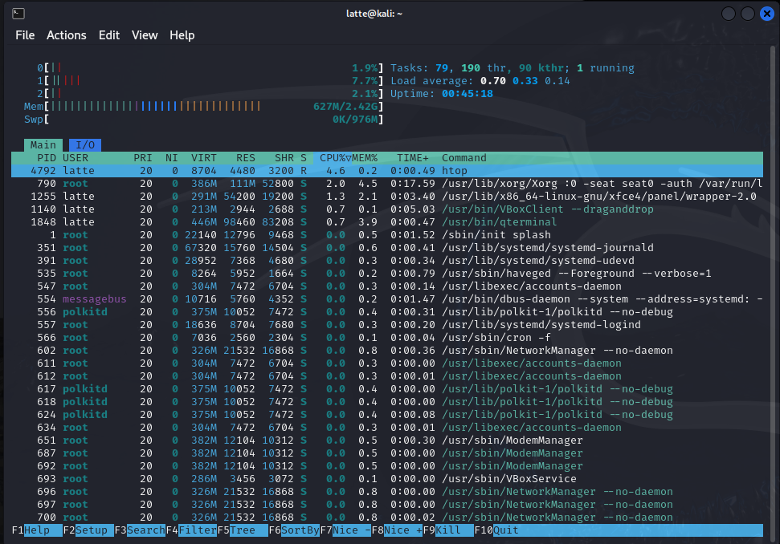
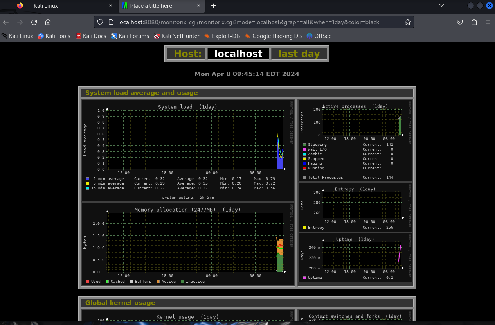

# Kali Linux VM Monitoring

## Introduction

This is a repository for monitoring a Kali Linux VM. Monitoring is essential for maintaining system health, identifying performance bottlenecks, and ensuring optimal resource utilization. This guide covers various monitoring tools and commands to track system metrics, including CPU, memory, disk, network, and process usage. 

### For detailed output and options, we can add `--help` after any command.

1. **CPU Load**: Helps in understanding the processing power demands and if they are within the system's capacity.

   -  `top` to see real-time CPU usage
  
 
    - `htop` for an enhanced view.
  

2. **Memory Usage**: show real-time process memory consumption:
   - `free -m` for memory in MB
  
   - `top` to see processes' memory use.

3. **Disk Usage**: Tracks how much storage is being used and available, critical for ensuring data storage does not reach full capacity unexpectedly.

   -  `df -h` shows disk space usage in human-readable format; 
  
   -  `iotop` monitors disk I/O.
   
1. **Log Files**: Contain detailed system, application, and security events. They are typically found in /var/log/ directory on Linux systems and are crucial for troubleshooting and monitoring system health.

   - Navigate using `cd /var/log/` and view logs with `less syslog` for system logs or with `less auth.log` for authentication logs.
   - Althernatively we can use `journalctl` - to view system logs.
  
  
1. **User Activity**: The last command can reveal who logged into the system, their activities, and log-off times, providing insights into user behavior and potential unauthorized access.

   - `last` gives a list of last logged-in users.
   

   - and for the activity of the current user we can use `w` or `who` commands.
   
  
1. **Accounting Utilities**: Tools like **acct**, **sar**, and **atop** provide detailed insights into system resource utilization, user activity, and performance metrics.

   - `acct` provides process accounting information. we need to install it with `sudo apt install acct` 
  
    

  and we can process the activities with the following: 
   - `lastcomm` shows the last commands executed by users.
   - `ac`- displays statistics about users' connect time.
   - `accton`- turns process accounting on or off.
   - `dump-acct`- prints the contents of the process accounting file.
   - `sa`- summarizes accounting information.
   - `dump-utmp`- prints the contents of the user accounting file.

1. **System Health**: System Health and Performance Metrics: Encompass CPU, memory, disk, and network utilization, along with load averages and process statistics to gauge overall system performance.

   - `vmstat` provides system statistics; 
  
   - `sensors` for hardware temps.
  
  
1.  **Uptime**: The uptime command shows how long the system has been running since its last restart, indicating stability.

    -  `uptime` tells how long the system's been running.
  
   
1.  **Network Traffic**: Tools like **iftop** or **nethogs** offer insights into real-time network bandwidth usage and traffic patterns, essential for identifying network bottlenecks or suspicious activity.

    -  `iftop` shows network usage.
  
    - Althernatively there is `nethogs` that shows network usage by process.

1. **Process Monitoring**: Tools like **ps** and **pstree** help monitor running processes, their resource consumption, and relationships between them.
  
      -  `ps aux` shows all running processes.
    
      -  `pstree` shows processes in a tree format.
    

# Advanced Monitoring:

Tools like **Glances**, **Sar**, **Vmstat**, **Monitorix**, and **NETHogs** offer more advanced monitoring capabilities, providing detailed insights into system performance and resource utilization.

## **Glances** 

- is a powerful system monitoring tool that provides real-time data on CPU, memory, disk, network, and process activity.
-  It offers a comprehensive overview of system health and performance, with interactive graphs and charts for easy visualization.
-  We first install it with `sudo apt install glances`
 - `glances` to start it
 - `q` to quit

 

## **Sar** 

- is a powerful command-line tool for monitoring system performance, collecting, displaying, and saving data for analysis. 
- It can monitor CPU, memory, disk, network, and process activity, providing insights into system health and performance. 
- We first install it with `sudo apt install sysstat` 
- Then we need to make sure that the data collection is enabled by editing the `/etc/default/sysstat` file and setting `ENABLED="true"`
- we restart the service with `sudo systemctl restart sysstat`
- and enable it with `sudo systemctl enable sysstat`
- and then run it with `sar`.
- The data should be stored in `/var/log/sysstat/` directory.

## **Vmstat** 

- is another useful tool for monitoring system performance, providing real-time data on CPU, memory, disk, and network activity.
-  It can help identify performance bottlenecks, track resource utilization, and optimize system performance. 
-  We first install it with `sudo apt install procps` 
-  then run it with `vmstat`. 
  
  
## **Monitorix**

-  is a lightweight system monitoring tool that collects and visualizes system performance data in graphs and charts. 
-  It can monitor CPU, memory, disk, network, and process activity, providing a comprehensive overview of system health and performance.
-  We first install it with `sudo apt install monitorix` 
-  we start the Monitorix service with `sudo systemctl start monitorix`
- we also enable it with the command `sudo systemctl enable monitorix` 
-  and then run it with `monitorix`.

- `http://localhost:8080/monitorix` to access the Monitorix web interface. 
  
  

## **NETHogs** 

- is a network monitoring tool that shows real-time network bandwidth usage by process.
-  It can help identify network bottlenecks, track network activity, and troubleshoot network performance issues.
- We first install it with `sudo apt install nethogs` and then run it with `nethogs`.
  
   

